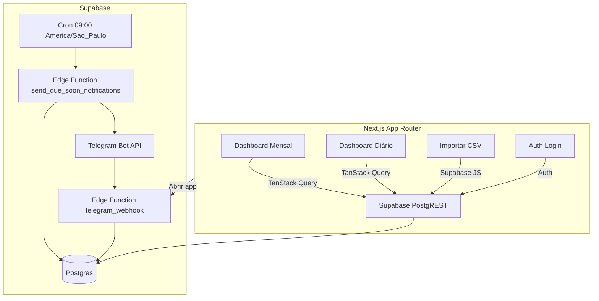

# Orbis Finance – MVP

Aplicativo web para substituir duas planilhas pessoais de finanças com dashboards mensal e diário, importação de faturas de cartão e notificações via Telegram.

## Visão Geral
- Dashboard mensal: receitas recorrentes, despesas fixas, faturas de cartões, saldo projetado.
- Dashboard diário: calendário por dia, itens do dia, saldo projetado e allowance diário.
- Automação: regras recorrentes geram projeções; importação CSV de faturas; upsert em `card_statements`.
- Notificações: alerta N dias antes do vencimento, com botões de ação no Telegram.
- Segurança: Supabase Auth; RLS por `user_id = auth.uid()`; tokens apenas em Edge Functions.

## Arquitetura


## Tecnologias
- Frontend: Next.js (App Router) + TypeScript, TailwindCSS, shadcn/ui (minimal), React Hook Form + Zod, TanStack Query, Recharts.
- Backend: Supabase (Postgres, Auth, Storage, Edge Functions, Scheduler).

## Setup
1. Pré-requisitos:
   - Node 18+
   - Conta Supabase
   - Bot Telegram
2. Variáveis de ambiente (Frontend):
   - `NEXT_PUBLIC_SUPABASE_URL`
   - `NEXT_PUBLIC_SUPABASE_ANON_KEY`
   - `NEXT_PUBLIC_APP_URL` (ex: `https://seuapp.com`)
3. Instalação:
   - `npm install`
   - `npm run dev`
4. Banco:
   - Crie um projeto no Supabase
   - Rode a migração [0001_init.sql](file:///Users/mariacagy/orbis-finance/supabase/migrations/0001_init.sql)
5. Autenticação:
   - Crie usuário via Supabase Auth (email/senha)
   - Faça login em `/login`

## Telegram
1. Crie bot com BotFather, obtenha `TELEGRAM_BOT_TOKEN`.
2. Salve o chat_id do usuário em `user_notification_settings`.
3. Secrets das Edge Functions:
   - `SUPABASE_URL`
   - `SUPABASE_SERVICE_ROLE_KEY`
   - `TELEGRAM_BOT_TOKEN`
   - `APP_URL`
4. Deploy Edge Functions:
   - `send_due_soon_notifications`
   - `telegram_webhook` (configure o webhook do bot para essa função)

## Cron
- Agende `send_due_soon_notifications` diariamente às 09:00 America/Sao_Paulo pelo Scheduler do Supabase.

## CSV de Exemplo
Arquivo `.csv` com cabeçalhos:
```
card_name,statement_month,due_date,amount_total
Nubank,2026-02,2026-02-15,1250.80
Itaú,2026-02,2026-02-12,890.40
```

## Fluxos Principais
- Importação CSV: cria/atualiza faturas por `user_id, card_id, statement_month`.
- Notificações:
  - Seleciona faturas abertas com `due_date = hoje + notify_days_before`.
  - Exclui se `snooze_until >= target`.
  - Evita duplicatas com `notification_log`.
  - Botões:
    - ✅ Pagar: atualiza `status` e `paid_at`.
    - ⏰ Adiar 2 dias: seta `snooze_until = hoje + 2`.
    - 📄 Abrir: retorna URL do app.

## Roadmap (Fase 2)
- Upload de PDFs e OCR.
- Categorias detalhadas e relatórios.
- Lançamentos transacionais e conciliação por conta.

## Desenvolvimento
- Scripts:
  - `npm run dev` – desenvolvimento
  - `npm run build` – build
  - `npm run start` – produção
  - `npm run lint` – lint
  - `npm run typecheck` – checagem de tipos

